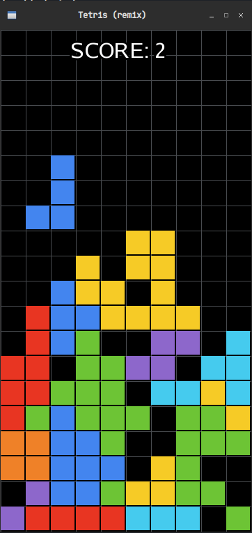

# Tetris
> Famous puzzle game remade with C++ and SFML

---

 

# Dependencies
+ [g++](https://github.com/gcc-mirror/gcc)
+ [SFML](https://github.com/SFML/SFML/)
+ [Make](https://github.com/wkusnierczyk/make)

---

# Building and Run

```bash
git clone https://github.com/terroo/tetris
cd tetris
make
```

---

Game made in the video tutorial: <https://www.youtube.com/watch?v=TRzFKQw-uX4>
